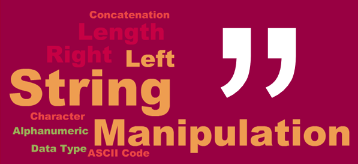

## Character Manipulation & Data Processing


#### STRINGS - You can create strings with either single quotes or double quotes. Unlike other languages, there is no difference in behaviour. I recommend always using ", unless you want to create a string that contains multiple ".

#### DATES -Always use the simplest possible data type that works for your needs. That means if you can use a date instead of a date-time, you should. Date-times are substantially more complicated because of the need to handle time zones.


## Implementation

#### String Manipulation with string:: The string package provides a set of internally consistent tools for working with character strings, i.e sequences of characters surrounded by quotation marks

## Results {.tabset .tabset-pills}

### Overview



```{r}
url.show("https://fivethirtyeight.com/features/the-economic-guide-to-picking-a-college-major/")
```


### Packages

```{r}

#Packages used

library(tidytext)
library(DT)
library(tm)
library(tidyverse)
library(stringr)

```

### 1.- Str_detect

#### {.tabset}
##### 1.1 String_Detect
###### Using the 173 majors listed in fivethirtyeight.com’s College Majors dataset, provide code that identifies the majors that contain either "DATA" or "STATISTICS"

```{r}

college_majors <-read.csv("https://raw.githubusercontent.com/fivethirtyeight/data/master/college-majors/majors-list.csv")

glimpse(college_majors)

```
```{r}
data_majors <- str_detect(college_majors$Major, fixed("DATA"))
college_majors[data_majors, ]
```
###### There is only one result that contains "DATA" = 2101

```{r}
stats_majors <- str_detect(college_majors$Major, fixed("STATISTICS"))
college_majors[stats_majors, ]

```
###### There is only one result that contains "STATISTICS" = 6212 + 3702
#### {-}
### 2.- String_extract
##### {.tabset}
###### 2.1 Fruits
####### Create Produce List for Next Week


[1] “bell pepper” “bilberry” “blackberry” “blood orange”

[5] “blueberry” “cantaloupe” “chili pepper” “cloudberry”

[9] “elderberry” “lime” “lychee” “mulberry”

[13] “olive” “salal berry”

Into a format like this:

c(“bell pepper”, “bilberry”, “blackberry”, “blood orange”, “blueberry”, “cantaloupe”, “chili pepper”, “cloudberry”, “elderberry”, “lime”, “lychee”, “mulberry”, “olive”, “salal berry”)

```{r}
str_1 = c("bell pepper", "bilberry", "blackberry", "blood orange", "bllueberry")
str_2 = c("blueberry", "cantaloupe", "chili pepper", "cloudberry")
str_3 = c("elderberry","lime","lychee","mulberry")
str_4 = c("olive", "salad berry")

fruit_list = c(str_1, str_2, str_3, str_4)
fruit_list

```
### 3.- String Expressions


##### {.tabset}
###### Expressions

####### (.)\1\1

This expression refers to groups - 
() - we use parenthesis to set precedent (order of evaluation)
in this case.

we need to type "(.)\\1\\1" in string to mean this in regexp (.)\1\1. 
it means the first capturing group in the matched expression. however, the expression is not complete. regexp will match (...) 


####### “(.)(.)\2\1”

The regexp back-references - that means it picks the second group before the fist.
ex.
"
```{r}
string_1 <- c("abba", "aaabbb","aaabbb", "abba", "bbaabbaa")
string_1 %>%
  str_detect(pattern = "(a)(b)\\2\\1")
  
```

####### (..)\1

This will search for two characters, repeated once, like “mama” or “5656”. The correct expression would be “(..)\1”.


####### (.).\\1.\\1"

This will search for a five character term, three of which are the same, like “momma” or “75717”.

####### "(.)(.)(.).*\\3\\2\\1"

This will construct a set of characters that begin and end with the same three characters, except the second instance is reversed, like “racecar” or “12378724321”.

##### {-}

### 4.- Construct

#### Strings
#### Construct regular expressions to match words that:

#### Start and end with the same character.
```{r}
str_bring <- function(string, pattern) {
  string[str_detect(string, pattern)]
}

```
```{r}
str_bring(fruit_list, "(.).*\\1$")
```


#### Contain a repeated pair of letters (e.g. “church” contains “ch” repeated twice.)

```{r}
str_subset(fruit_list, "([A-Za-z][A-Za-z]).*\\1")

```


#### Contain one letter repeated in at least three places (e.g. “eleven” contains three “e”s.) 


```{r}
str_subset(fruit_list, "([a-z]).*\\1.*\\1")
```


